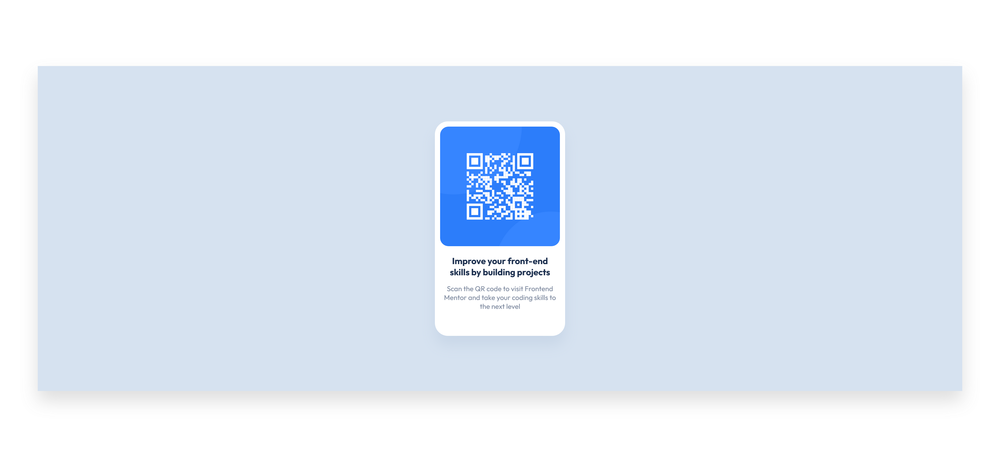

# Frontend Mentor - QR code component solution

This is a solution to the [QR code component challenge on Frontend Mentor](https://www.frontendmentor.io/challenges/qr-code-component-iux_sIO_H). Frontend Mentor challenges help you improve your coding skills by building realistic projects. 

## Table of contents

  - [Screenshot](#screenshot)
  - [Links](#links)
  - [Built with](#built-with)
  - [What I learned](#what-i-learned)
  - [Continued development](#continued-development)
  - [Useful resources](#useful-resources)
- [Author](#author)

### Screenshot

### Links

- Solution URL: (https://www.frontendmentor.io/solutions/solution-using-css-flexbox-BJ1DVGKa45)
- Live Site URL: (https://rrincones.github.io/qr-code-component/)

### Built with

- Semantic HTML5 markup
- CSS custom properties
- Flexbox

### What I learned

The main thing I learned was how to center elements both horizontally and vertically using Flexbox. I had to look up how to do this once I discovered that I couldn't center an element vertically by using the margin property set to auto. The rest of the challenge allowed me to reinforce things I previously learned through tutorials. Sometimes I pick up tidbits here and there as I search for things on the MDN developer site and other places. 

### Continued development

Because this is my first project, I realize I still have so much to learn that it's hard to pick just a few things to focus on. However, a few things that stand out are CSS Flexbox and Grid and getting better at using the correct semantic HTML elements. I want to nail down the fundamentals and just establish good habits as I continue to learn. 

### Useful resources

- (https://www.freecodecamp.org/news/how-to-center-an-image-in-css/) - This article helped to explain how to vertically center an element using Flexbox. 

## Author

- Frontend Mentor - [@rrincones](https://www.frontendmentor.io/profile/rrincones)